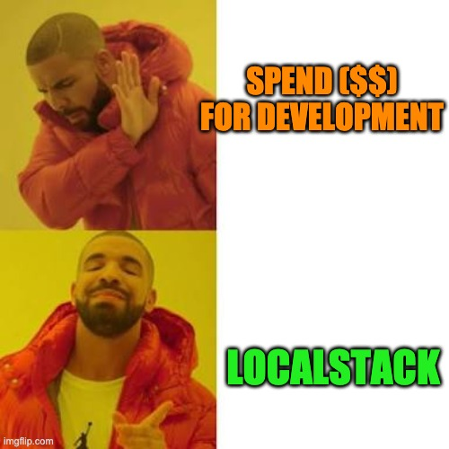

AWS provides a lot of useful tools and services like Lambda, queue(s), DynamoDB, S3, Cloudwatch. Only way start developing application with these services is with AWS ( Development Account ). but not anymore, we have mature solution for local Development: LOCALSTACK


>LocalStack spins up the most used core AWS managed services on your local machine, and "it is exact replica", which means it is language agnostic and support all events from local services as AWS.


#### How doest it work?
Lets create a example. A python `lambda`, that can log with `Cloudwatch Logs`.


##### Prerequisite installation:

1. [Docker](https://www.docker.com/get-started): Use localstack as docker image.
2. [Terraform](https://www.terraform.io/downloads.html): Tool for `Infrastructure as Code`, we will use it for localstack as well.
3. [Aws-Cli](https://aws.amazon.com/cli/): for managing AWS services.

Now, jump to your favorite folder in terminal and setup folder structure required.

```noLineNumbers
mkdir tf-lambda-test tf-lambda-test/iam .localstack

cd tf-lambda-test && touch docker-compose.yml lambda.tf lambda-iam.tf \
  provider.tf example.py iam/lambda-policy-file.tf lambda-assumed-policy-file.tf
```


##### Setup localstack  
Let's spin up a container with require services `lambda,logs,iam`. You can find the list of all the supported services [here](https://github.com/localstack/localstack).


```yml:title=./docker-compose.yml
version: '3.2'
services:
  localstack:
    image: localstack/localstack:latest
    container_name: localstack_exmaple_lambda
    ports:
      - '4563-4599:4563-4599'
      - "${PORT_WEB_UI-8080}:${PORT_WEB_UI-8080}"
    environment:
      - SERVICES=lambda,logs,iam
      - DEBUG=1
      - DATA_DIR=/tmp/localstack/data
      - PORT_WEB_UI=${PORT_WEB_UI- }
    volumes:
      - './.localstack:/tmp/localstack'
      - '/var/run/docker.sock:/var/run/docker.sock'
```

You can run Localstack by  
`docker-compose up -d`
  
#  
##### Lambda handler function:  
Creating simple hello function, which is getting first_name and last_name as argument from lambda, and returning the created message back as JSON.  

```python:title=./example.py
def hello(event, context):
    message = f"Welcome to localstack, {event['first_name']} {event['last_name']}."
    print(message)
    return {
        'message': message
    }
```
#  
##### Setup Terraform:
Each of the lambda, requires permission, role and resources, lets create them step by step.

###### IAM setup
Current example lambda requires `cloudwatch logs` permissions to create a stream and events. To define such Policies, lets create the policy file.
we can utilize the tool like [AWS Policy Generator](https://awspolicygen.s3.amazonaws.com/policygen.html). for simplicity, here is the example, with all the permission for `IAM - Amazon CloudWatch Logs`.

```json:title=./iam/aws_iam_policy.json
{
    "Version": "2012-10-17",
    "Statement": [
        {
            "Sid": "Stmt1593846179018",
            "Action": "logs:*",
            "Effect": "Allow",
            "Resource": "*"
        }
    ]
}
```

Now, lets create a role file, which will define our service to be lambda.

```json:title=./iam/aws_iam_assume_policy.json
{
    "Version": "2012-10-17",
    "Statement": [
        {
            "Action": "sts:AssumeRole",
            "Principal": {
                "Service": "lambda.amazonaws.com"
            },
            "Effect": "Allow",
            "Sid": ""
        }
    ]
}
```

To apply these policies to role, add following in `lambda-iam` file.


```hcl:title=./lambda-iam.tf
resource "aws_iam_role_policy" "example_lambda_policy" {
  name = "example_lambda_policy"
  role = aws_iam_role.example_lambda_role.id

  policy = "${file("./iam/aws_iam_policy.json")}"
}

resource "aws_iam_role" "example_lambda_role" {
  name = "example_lambda_role"

  assume_role_policy = "${file("./iam/aws_iam_assume_policy.json")}"
}
```

Here, we are defining resource `aws_iam_role_policy`, which will apply to role name `example_lambda_role`. with terraform `file` function, we are attaching the policy and assumed policy json.  

###### Lambda infrastructure setup

Once the role is available, we can move forward to create a local lambda.

```hcl:title=./lambda.tf
locals {
    # Use local Zip setup for lambda
    lambda_zip_location = "outputs/example.zip"
}

data "archive_file" "example" {
  # TF utility to archive file in Local
  type        = "zip"
  source_file = "example.py"
  output_path = "${local.lambda_zip_location}"
}

resource "aws_lambda_function" "example_lambda" {
  # zip Location
  filename      = "${local.lambda_zip_location}"
  function_name = "example"
  role          = "${aws_iam_role.example_lambda_role.arn}"
  handler       = "example.hello"

  # zip hash, on redeploy check if any changes are there.
  source_code_hash = fileexists(local.lambda_zip_location) ?  "${filebase64sha256(local.lambda_zip_location)}": "000"


  #runtime environment
  runtime = "python3.7"
}
```


`aws_lambda_function` will create lambda resource in AWS with name *example_lambda* and defining handler, role and lambda name (function_name) with run time environment as required. The `source_code_hash` variable will hold the value of Hash of Zip file, in case of redeploy, if there is no change, lambda won't be recreated.

To ease the process of creating zip file, will be utilize the `archive_file` resource from terraform which will create a zip file as `outputs/example.zip`.
  

##### Terraform specification for Localstack:
if we are applying the terraform at current stage, it will try to create the actual lambda in AWS with help of global available AWS profile.
to avoid this, we will create provider for terraform.

```hcl:title=./provider.tf
provider "aws" {
  access_key                  = "mock_access_key"
  region                      = "us-east-1"
  s3_force_path_style         = true
  secret_key                  = "mock_secret_key"
  skip_credentials_validation = true
  skip_metadata_api_check     = true
  skip_requesting_account_id  = true

  endpoints {
    lambda         = "http://localhost:4566"
    cloudwatchlogs = "http://localhost:4566"
    iam            = "http://localhost:4566"
  }
}
```
Here we are providing fake credential, also the localstack endpoint for service where terraform should request.

Once all files are define, terraform can be initiated with following function.  
`terraform init`

#### Final Moment:

Once initialization of the terraform completed, and localstack docker instance is running we are ready to deploy our lambda with following command.

`terraform apply -lock=false -auto-approve`

It should show a resource being created as below.
<div>

</div>
  
  


###### Invoking Lambda

its time to invoke our local lambda, with `aws-cli`, Output of lambda request will be written to `output.json`

```noLineNumbers
aws --endpoint=http://localhost:4566 lambda invoke \
--function-name example  \
--payload '{ "first_name": "Parth", "last_name": "Shah"}' \
--log-type Tail  --region=us-east-3 output.json
```

The localstack docker can show following logs, including billed duration and memory as well.
***Wow, you just saved 100ms billing cost.***

```:title=Docker-logs
START RequestId: fbf1883e-219e-1ef0-7378-4ae31b496c5e Version: $LATEST
Welcome to localstack, Parth Shah.
END RequestId: fbf1883e-219e-1ef0-7378-4ae31b496c5e
REPORT RequestId: fbf1883e-219e-1ef0-7378-4ae31b496c5e
Init Duration: 84.48 ms	Duration: 4.12 ms
Billed Duration: 100 ms	Memory Size: 1536 MB	Max Memory Used: 23 MB
```
# 
###### Cloudwatch logs

Lambda having print statement, which should be log into cloudwatch logs.
First lets find if log group is being created, Real AWS lambda log group name will be */aws/lambda/<function-name\>*

`aws --endpoint=http://localhost:4566 logs describe-log-groups`

```json
{
    "logGroups": [
        {
            "logGroupName": "/aws/lambda/example",
            "creationTime": 1593866928785,
            "metricFilterCount": 0,
            "arn": "arn:aws:logs:us-east-1:1:log-group:/aws/lambda/example",
            "storedBytes": 1622
        }
    ]
}
```

lets find out log streams with */aws/lambda/example*, with following command.

`aws --endpoint=http://localhost:4566 logs describe-log-streams --log-group-name /aws/lambda/example`

This will return actual AWS streams like JSON array of streams where IDs should be as date of creation and few random characters as *2020/07/04/[LATEST]66687e4d*

now to see actual log occur, run the following command,

`aws --endpoint=http://localhost:4566 logs get-log-events --log-group-name /aws/lambda/example --log-stream-name '2020/07/04/[LATEST]66687e4d'`

and ...It returns the correct log

```json
{
    "events": [
        {
            "timestamp": 1593890084734,
            "message": "\u001b[32mSTART RequestId: fbf1883e-219e-1ef0-7378-4ae31b496c5e Version: $LATEST\u001b[0m",
            "ingestionTime": 1593890084794
        },
        {
            "timestamp": 1593890084747,
            "message": "Welcome to localstack, Parth Shah.",
            "ingestionTime": 1593890084794
        },
        {
            "timestamp": 1593890084760,
            "message": "\u001b[32mEND RequestId: fbf1883e-219e-1ef0-7378-4ae31b496c5e\u001b[0m",
            "ingestionTime": 1593890084794
        },
        {
            "timestamp": 1593890084773,
            "message": "\u001b[32mREPORT RequestId: fbf1883e-219e-1ef0-7378-4ae31b496c5e\tInit Duration: 84.48 ms\tDuration: 4.12 ms\tBilled Duration: 100 ms\tMemory Size: 1536 MB\tMax Memory Used: 23 MB\t\u001b[0m",
            "ingestionTime": 1593890084794
        }
    ],
    "nextForwardToken": "f/00000000000000000000000000000000000000000000000000000003",
    "nextBackwardToken": "b/00000000000000000000000000000000000000000000000000000000"
}
```
  

#  
##### TL,DR:

Localstack is a very powerful tool, when you need to test and develop something that requires AWS resources, it can definitely save your time without additional requirements (*and some money as well, to be honest!*)

  

- - -
Ref:  
https://www.terraform.io/docs/providers/aws/guides/custom-service-endpoints.html  


### Thanks for reading